<a name="readme-topo"></a>

<h1 align='center'>
  🔬Determinação do Calor Específico de Metais 
</h1>

<div align='center'>

<!-- react, vite, miu, typescript -->
[![NPM][npm-badge]][npm-url]
[![TS][typescript-badge]][typescript-url]
[![REACT][react-badge]][react-url]
[![VITE][vite-badge]][vite-url]
[![MIU][miu-badge]][miu-url]
[![FIREBASE][firebase-badge]][firebase-url]
[![ARDUIINO-IDE][arduino-ide-badge]][arduino-ide-url]
[![IDE][vscode-badge]][vscode-url]

Física Esperimental I<br>
Engenharia de Computação <br>
Prof. Rafael Marcelino <br>
CEFET-MG Campus V <br>
2024/1  
</div>

<details>
  <summary>
  <b style='font-size: 15px'>
    📑 Sumário
  </b>
  </summary>
  <ol>
    <li><a href="#-introdução">🔍 Introdução</a></li>
    <li>
      <a href="#-fundamentação-teórica">💡 Fundamentação Teórica</a>
    </li>
    <li>
      <a href="#%EF%B8%8F-metodologia-e-materiais-utilizados">🗳️ Metodologia e Materiais Utilizados</a>
      <ul>
        <li><a href='#descrição-dos-materiais'>Descrição dos Materiais</a></li>
        <li><a href='#montagem-do-experimento'>Montagem do Experimento</a></li>
        <li><a href='#procedimento-experimental'>Procedimento Experimental</a></li>
      </ul>
    </li>
    <li>
      <a href="#-resultados-e-análises">📊 Resultados e Análises</a>
    </li>
    <li><a href="#-conclusão">🏁 Conclusão</a></li>
    <li>
      <a href="#-executando">🔨 Executando</a>
      <ul>
        <li><a href="#execução-do-programa-arduino-ide">Execução do Programa Arduino IDE</a></li>
        <li><a href="#execução-do-programa-web">Execução do Programa Web</a></li>
      </ul>
    </li>
    <li><a href="#-ambiente-de-compilação-e-execução">🧪 Ambiente de Compilação e Execução</a></li>
    <li><a href="#-contato">📨 Contato</a></li>
    <li><a href="#-referências">📚 Referências</a></li>
  </ol>
</details>

## 🔍 Introdução

<div align='justify'>

  Este projeto tem como objetivo aprimorar o experimento de automatização do processo de coleta do tempo necessário para que um determinado líquido varie sua temperatura [^1]. As melhorias incluem a modificação do procedimento experimental, em que o material aquecido será adicionado à água em temperatura ambiente, e o tempo necessário para alcançar o equilíbrio térmico é medido, com o objetivo de encontrar o calor específico do material. Além disso, a plataforma web será atualizada para incluir campos de entrada dos dados da água e do material, melhorar a interface do usuário, e implementar gráficos dinâmicos para visualização em tempo real da variação de temperatura. Essas melhorias visam aumentar a precisão do experimento e proporcionar uma melhor experiência de usuário. 

</div>

<p align="right">(<a href="#readme-topo">voltar ao topo</a>)</p>

## 💡 Fundamentação Teórica

<div align='justify'>

Em experimentos onde o controle da troca de calor é crucial, como no cálculo do calor específico, o uso de materiais isolantes é essencial. Isolantes minimizam a transferência de calor entre sistemas, permitindo uma medição mais precisa do calor específico dos materiais. No experimento, utilizaremos um calorímetro equipado com isolantes para medir a quantidade de calor transferido durante o processo. A precisão dos resultados depende da eficiência do isolante em manter o equilíbrio térmico dentro do calorímetro.

Como menciona Young e Freedman em seu livro [^2], quando você coloca uma colher fria em uma xícara de café quente, a colher esquenta e o café esfria até que ambos atinjam o equilíbrio térmico. Essa interação envolve a transferência de energia entre as substâncias, denominada calor. A diferença entre calor e temperatura é fundamental: enquanto a temperatura indica o estado físico de um material (quente ou frio), o calor refere-se à transferência de energia devido à diferença de temperatura entre dois corpos. Assim temos a equação:

$$ Q = m \cdot c \cdot \Delta T $$

Para uma variação infinitesimal, temos:

$$ dQ = m \cdot c \cdot dT $$

Assim, o calor específico *c* é: 

$$ c = \frac{1}{m} \frac{dQ}{dT} $$

Quando *Q* e $\Delta T$ são positivos, o calor é transferido para o corpo, e sua temperatura aumenta; quando negativos, o calor é liberado, e a temperatura diminui.

O equilíbrio térmico ocorre quando dois sistemas em contato atingem a mesma temperatura e não há mais transferência de calor entre eles. No experimento, o equilíbrio térmico é essencial para determinar o calor específico de materiais sólidos.

De acordo com a lei de conservação de energia:

$$ Q_{M} = - (Q_{A} + Q_{C}) $$

Substituindo as expressões para o calor:

$$ m_{M} \cdot c_{M} \cdot \Delta T_{M} = - (m_{a} \cdot c \cdot \Delta T_{A} + C \cdot \Delta T_{C}) $$

Onde: 

- $m_{a} e m_{M}$ são as massas da água e do material, respectivamente.
- $c$ e $c_{M}$ são os calores específicos da água e do material, respectivamente.
- $\Delta T_{A}, \Delta T_{M}$ e $\Delta T$ são as variações de temperatura da água, do material e do calorímetro, respectivamente.
- $C$ é a capacidade térmica do calorímetro.

O valor de *C* foi calculado em experimentos anteriores:

$$ C = \left| \frac{m_{aQ} \cdot c \cdot (T - T_Q) + m_{aA} \cdot c \cdot (T - T_A)}{T - T_A} \right| $$

Para determinar o calor específico $c_{M}$ do material, a equação é reescrita como:

$$ c_{M} = - \frac{m_{a} \cdot c \cdot \Delta T_{A} + C \cdot \Delta T_{C}}{m_{M} \cdot \Delta T_{M}} $$

Essa equação permite calcular o calor específico do material a partir das massas, calores específicos conhecidos e variações de temperatura. Veja a tabela a seguir com alguns valores de calor específico de materiais comuns:

</div>

<div align='center'>
    <b>Tabela de Calores Específicos:</b>
    <table>
        <tr>
            <th>Material</th>
            <th>Calor Específico (J/kg°C)</th>
            <th>Calor Específico (cal/g°C)</th>
        </tr>
        <tr>
            <td>Água Pura (20°C)</td>
            <td>4182</td>
            <td>1.000</td>
        </tr>
        <tr>
            <td>Alumínio</td>
            <td>897</td>
            <td>0.214</td>
        </tr>
        <tr>
            <td>Cobre</td>
            <td>385</td>
            <td>0.092</td>
        </tr>
        <tr>
            <td>Ferro</td>
            <td>449</td>
            <td>0.107</td>
        </tr>
        <tr>
            <td>Prata</td>
            <td>235</td>
            <td>0.0561</td>
        </tr>
        <tr>
            <td>Ouro</td>
            <td>129</td>
            <td>0.0308</td>
        </tr>
        <tr>
            <td>Madeira</td>
            <td>1300 - 2400</td>
            <td>0.311 - 0.573</td>
        </tr>
        <tr>
            <td>Bronze</td>
            <td>370</td>
            <td>0.0884</td>
        </tr>
    </table>
</div>

<p align="right">(<a href="#readme-topo">voltar ao topo</a>)</p>


## 🗳️ Metodologia e Materiais Utilizados

<div align="justify">

  ### Descrição dos Materiais
  - **Calorímetro**: Dispositivo destinado a medir a quantidade de calor transferido durante o processo. Sua capacidade térmica é de 15,1 ± 4,1 cal/ºC.
  - **Sensor de Temperatura (DS18B20)**: Alta precisão (±0.5°C) e resolução de até 12 bits.
  - **Microcontrolador (ESP8266)**: Utilizado para leitura do sensor de temperatura e transmissão dos dados.
  - **Fonte de Calor**: Ebulidor, para aquecer o material através da água.
  - **Material a ser Estudado**: Cilindros de alumínio e ferro.
  - **Balança de Precisão**: Para medição das massas dos materiais.
  - **Termômetro**: Para medir a temperatura do metal.
  - **Béquer**: Para armazenar a água e o material.
  - **Água**: Utilizada para aquecer o material e medir a variação de temperatura.

  ### Montagem do Experimento
  - **Montagem do Circuito Eletrônico**:  O sensor DS18B20 será conectado ao ESP8266. A leitura dos dados será feita e enviada via Wi-Fi para uma plataforma web. Veja a imegem abaixo:
</div>

<div align="center">
    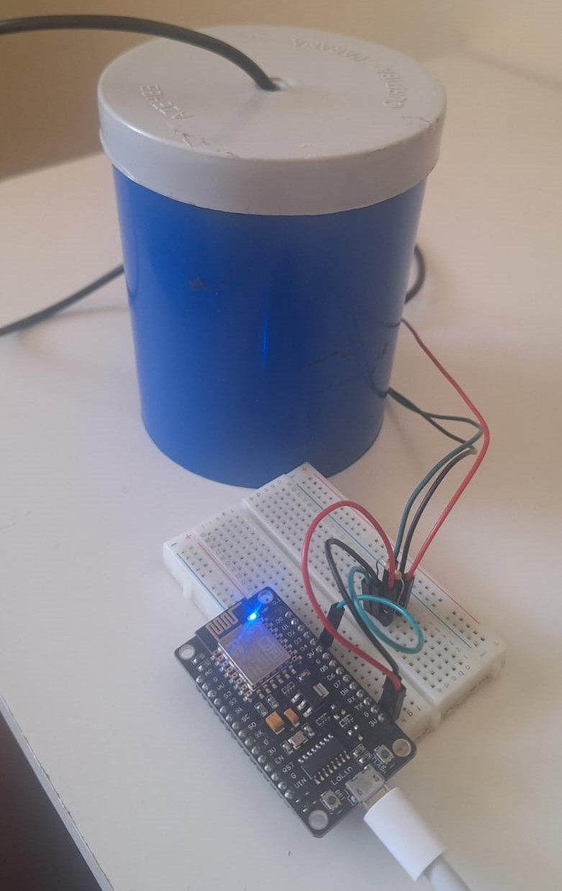
    <p>Figura 1: Montagem do Circuito Eletrônico</p>
</div>

<div align="justify">

  - **Configuração do Calorímetro**: No calorímetro será colocada uma quantidade de água, registrando sua temperatura inicial, para que dessa maneira, posteriormente, seja colocado o material sólido aquecido a uma determinada temperatura, até que o equilíbrio térmico seja atingido.
  - **Interface Web**: Os dados de temperatura serão transmitidos em tempo real para uma plataforma web desenvolvida com a linguagem *TypeScript* em seu ambiente de execução *React.js*. Um banco de dados *NoSQL* (*Firebase*) será utilizado para armazenar os dados obtidos pelo sensor de temperatura, e sempre que houver uma atualização nesse banco, a plataforma receberá essas informações instantaneamente.

  ### Procedimento Experimental
1. **Medir a massa dos elementos**: Serão medidas e armazenadas as massas do material analisado e da água em temperatura ambiente.
2. **Medir a temperatura ambiente**:  Ao colocar a água no calorímetro, será realizada uma primeira medição da temperatura para armazená-la e utilizá-la no sistema.
3. **Aquecer o Material**: O material será aquecido até uma determinada temperatura. Para tal, a água será aquecida no béquer com o ebulidor com o material  mergulhado nela. Após certo tempo, em que o material entrar em equilíbrio térmico com a água, a temperatura será armazenada.
4. **Inserção do Material**: Após aquecer o material, esse será inserido no calorímetro com água em temperatura ambiente. Para minimizar a troca de calor com o ambiente durante a inserção, o calorímetro deve ser rapidamente fechado após a colocação do material.
5. **Monitoramento e Coleta de Dados**: O sensor de temperatura DS18B20 monitorará a temperatura da água e do material a intervalos regulares de tempo. Então, os dados serão automaticamente registrados e transmitidos para a plataforma web para armazenamento e análise.
6. **Estabelecimento do Equilíbrio Térmico**: O sistema será monitorado até que a temperatura do material e da água se igualem, indicando que o equilíbrio térmico foi alcançado.
7. **Processamento do Dados**: Os dados coletados serão analisados utilizando técnicas de regressão linear para determinar a variação de temperatura ao longo do tempo.
8. **Cálculo do Calor Específico**: Com base nos dados coletados, o calor específico do material será calculado utilizando a equação apresentada anteriormente.
9. **Cálculo da Incerteza**: A incerteza associada ao cálculo do calor específico será determinada com base nas incertezas das medições de massa, temperatura e capacidade térmica do calorímetro.
10. **Análise dos Resultados**: Os resultados obtidos serão comparados com os valores teóricos de calor específico para o material analisado, e a precisão do experimento será avaliada.

</div>

<p align="right">(<a href="#readme-topo">voltar ao topo</a>)</p>

## 📊 Resultados e Análises

<div  align="justify">

  Com a implementação do sistema automatizado de monitoramento de temperatura, que utiliza o sensor DS18B20, o microcontrolador ESP8266 e uma plataforma web integrada ao Firebase, obtivemos resultados significativos. Nesta seção, apresentaremos uma análise detalhada dos resultados experimentais, incluindo a avaliação da implementação do site, suas otimizações, e o cálculo do calor específico do material.

  Primeiramente, a automatização do processo de medição de temperatura proporcionou uma leitura em tempo real altamente confiável. O sensor DS18B20 capturou as variações de temperatura e enviou os dados de forma contínua para o banco de dados do Firebase.

  O site, desenvolvido com TypeScript, foi otimizado para requisitar a temperatura a cada 30 segundos. Caso não houvesse uma variação de 0,1ºC durante esse intervalo, consideramos que o sistema havia alcançado o equilíbrio térmico.

  Para o cálculo do calor específico, foram plotados inicialmente no programa dados essenciais, como a massa da água, a massa do objeto submerso e a temperatura inicial do objeto. Após isso, o material quente foi inserido no calorímetro e esse por sua vez fechado. O sensor captou a variação de temperatura até que o equiilíbrio térmico fosse alcançado. Quando isso acontece, o cálculo do calor específico pode ser realizado, visto que todas as variáveis necessárias foram obtidas para o programa. Adicionalmente, o site foi projetado para comparar o valor obtido com uma base de dados, indicando o material correspondente ao calor específico calculado. Essa comparação é realizada ao calcular a diferença percentual entre o valor encontrado pelo experimento e cada um dos valores que existem na base de dados (segundo a Tabela \ref{tab:calorespecifico}). Além disso, também foram calculadas as diferenças percentuais entre os valores da tabela e o encontrado somado e subtraído da sua respectiva incerteza. Com essas três diferenças percentuais para cada um dos valores, foi calculada uma média entre elas e, o material com a menor média foi considerado o mais provável utilizado. 

  Vale ressaltar que o programa escolhe um dos materiais mas deixa uma lista com todas as similaridades calculadas. Isso foi feito pois há casos em que, para materiais com valores de calor específico muito próximos, o programa escolhe errado. Mas através das similaridades, o experimentador pode observar as maiores porcentagens e considerar as características físicas do material para se ter mais certeza do resultado. Por exemplo, o calor específico do ferro e do cobre são muito próximos. Por isso, pode ser que ao testarmos colocarndo ferro no calorímetro o programa informe que é cobre. Porém, a similaridade do valor encontrado com o calor específico do ferro será alta e, considerando que o ferro e o cobre podem ter características físicas diferentes, como a cor, podemos supôr que o programa errou a classificação principal e na verdade deveria ser de fato o ferro.  

  Para validar o programa, foram realizados dois testes para cada material com o intuito de determinar o calor específico deles, sendo o primeiro o ferro e o segundo o alumínio.

  No primeiro teste realizado, foi inserido no calorímetro uma quantidade de água e  de ferro. A temperatura do ferro foi medida antes de sua inserção no calorímetro, visto que esses dados são requeridos pelo programa antecipadamente. Após a inserção do metal, as medições de temperatura pelo sensor começaram até que o equilíbrio térmico fosse atingido a uma temperatura específica. Com isso, o programa calculou o calor específico e retornou os valores de $0,0986 \pm 0,0099$ cal/g°C para o primeiro teste e $0,098 \pm 0,031$ cal/g°C para o segundo, conforme mostrado nas imagens abaixo:

</div>

<div align="center">
    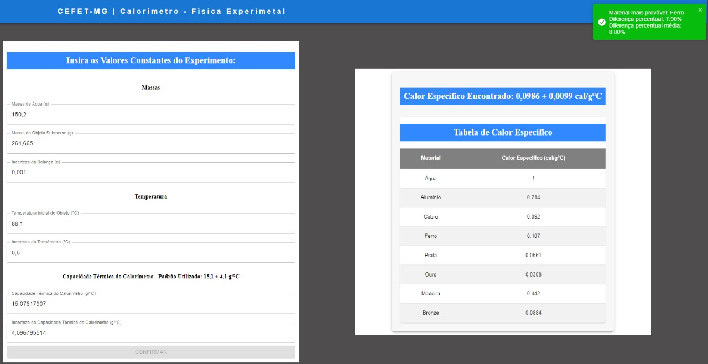
    <p>Figura 2: Gráfico do Teste 1 com Ferro</p>
</div> <br>

<div align="justify">

  A Figura 2 é do primeiro teste realizado com ferro antes de se informar a similaridade de todos os materiais com o valor encontrado. Ao ser notado que o programa poderia se equivocar com valores muito próximos, foi adicionada a coluna de similaridade como mostra a Figura 3.

</div>

<div align="center">
    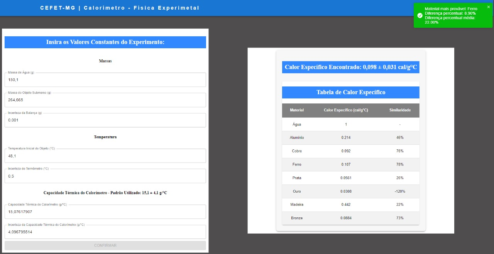
    <p>Figura 3: Gráfico do Teste 2 com Ferro</p>
</div>

<div align="justify">

  Considerando as incertezas, esses valores se mostraram condizentes com o calor específico do ferro que é de $0,107$ cal/gºC, demonstrando, dessa maneira, a eficácia do programa. Além de retornar o material mais provável, o programa também calculou a diferença percentual e a diferença percentual média.

  Para o segundo elemento testado, o alumínio, o mesmo procedimento foi realizado. A água e o alumínio foram novamente medidos, e seus valores foram inseridos no programa. A temperatura do alumínio foi medida antes de sua inserção no calorímetro. Após a inserção, o sensor monitorou a temperatura até que o equilíbrio térmico fosse alcançado. O programa então calculou o calor específico do alumínio , retornando um valor de $0,201 \pm 0,053$ cal/gºC para o primeiro teste e $0,195 \pm 0,040$ cal/gºC para o segundo teste. 
  
  Esses valores calculados pelo programa se mostraram  consistentes com o valor do calor específico do alumínio que é de $0,214$ cal/gºC, reforçando a precisão e a confiabilidade do sistema automatizado de monitoramento de temperatura.As imagens abaixo mostram esses resultados obtidos pelo programa:

</div>

<div align="center">
    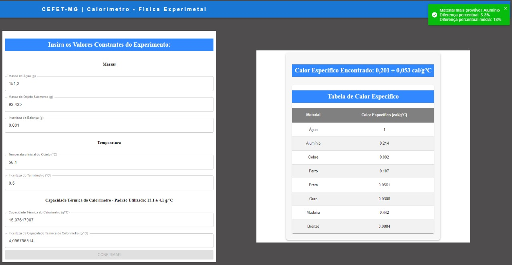
    <p>Figura 4: Gráfico do Teste 1 com Alumínio</p>
</div>

<div align="justify">

  De maneira similar ao teste com ferro, a Figura 4 representa um teste realizado antes da adequação do *software* para lidar com as classificações incorretas. Já a Figura 5 conta com a coluna adicional.

</div>

<div align="center">
    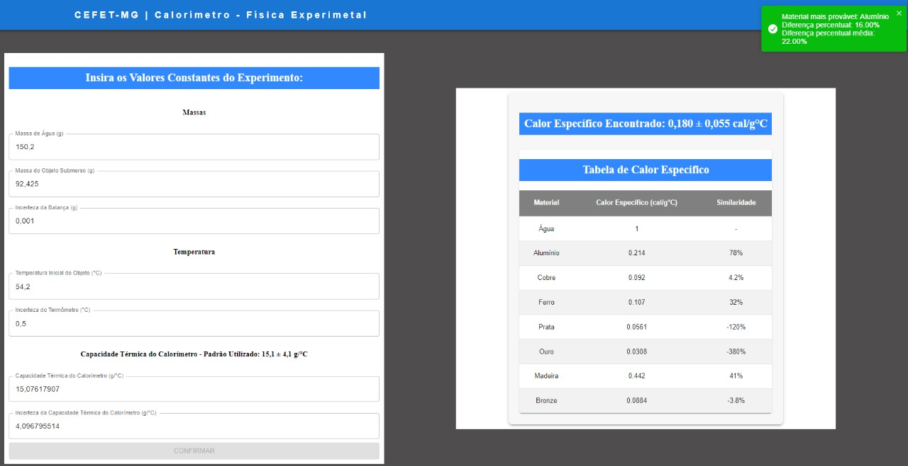
    <p>Figura 5: Gráfico do Teste 2 com Alumínio</p>
</div>

<div align="justify">

  Esses resultados não apenas validaram a metodologia proposta, mas também destacaram a importância da automação na coleta de dados experimentais, proporcionando uma experiência de usuário aprimorada e resultados mais precisos.

</div>

<p align="right">(<a href="#readme-topo">voltar ao topo</a>)</p>

## 🏁 Conclusão

<div  align="justify">

  A implementação do sistema automatizado de monitoramento de temperatura, utilizando o sensor DS18B20, o microcontrolador ESP8266 e uma plataforma web integrada ao Firebase, demonstrou ser uma abordagem eficaz para a determinação do calor específico de materiais. A automatização do processo de coleta de dados não apenas melhorou a precisão das medições, mas também proporcionou uma experiência de usuário mais intuitiva e interativa.

  Os resultados obtidos nos testes com o ferro e o alumínio confirmaram a eficácia do sistema, com os valores calculados de calor específico alinhando-se com os dados conhecidos na literatura. A capacidade do sistema de registrar e transmitir dados em tempo real permitiu um monitoramento contínuo e confiável, essencial para a validação dos experimentos.

  Além disso, as otimizações realizadas na interface web, como a atualização em tempo real e a comparação com uma base de dados, enriqueceram a análise dos resultados, facilitando a interpretação dos dados coletados. 

  Em conclusão, este projeto não apenas aprimorou o experimento de determinação do calor específico, mas também mostrou como a automação pode facilitar a realização de experimentos de física. As melhorias implementadas oferecem um caminho promissor para futuras investigações, permitindo que novos materiais sejam explorados e que novas tecnologias sejam integradas ao processo experimental. Essa abordagem pode, assim, contribuir para um aprendizado mais eficaz e dinâmico na área de física.

</div>

<p align="right">(<a href="#readme-topo">voltar ao topo</a>)</p>

## 🔨 Executando

<div align="justify">

  Nesta seção estão exemplificados os meios através dos quais se tornam possíveis a compilação e execução do programa apresentado.

</div>

### Execução do Programa Arduino IDE

<div align="justify">

  Para compilar e executar o programa, siga os passos abaixo:

  1. Clone o repositório no diretório desejado:
  ```console
  git clone https://github.com/dudatsouza/trabalhoFisicaExp.git

  cd trabalhoFisicaExp
  ```
  
  2. Abra o arquivo [codigoEsp.ino](./src/eso8266/codigoEsp.ino) no *Arduino IDE* e faça o upload para o microcontrolador.

  3. Conecte o sensor de temperatura ao microcontrolador e monte o circuito conforme a figura abaixo:

</div>

<div align="center">
    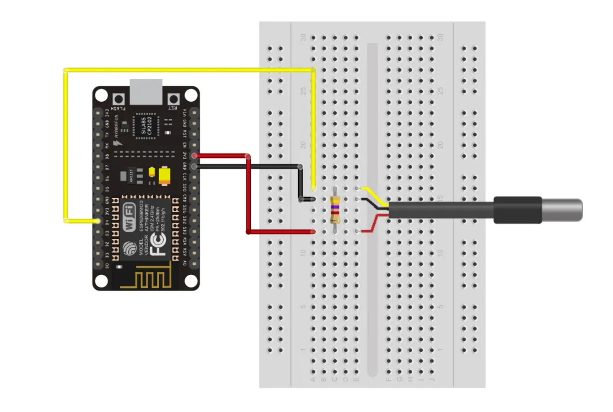
    <p>Figura 6: Montagem do Circuito Eletrônico</p>

</div>

<div align="justify">

  5. Instale as bibliotecas necessárias tanto para o sensor de temperatura quanto para o microcontrolador. Para isso, siga os passos abaixo:

  #### Bibliotecas para o Microcontrolador ESP8266
  Primeira etapa você deve abrir o *Arduino IDE* e ir em **Arquivo (File) > Preferências (Preferences)**. 

</div>

<div align="center">
    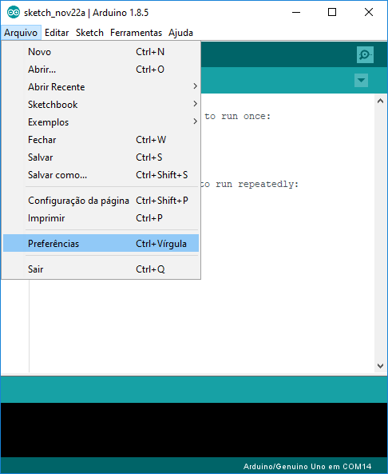
    <p>Figura 7: Preferências do Arduino IDE</p>
</div>
  
<div align="justify">
  
  No campo **URLs Adicionais para Gerenciadores de Placas (Additional Boards Manager URLs)**, adicione o link: 

  ```console
  http://arduino.esp8266.com/stable/package_esp8266com_index.json
  ```

</div>

<div align="center">
    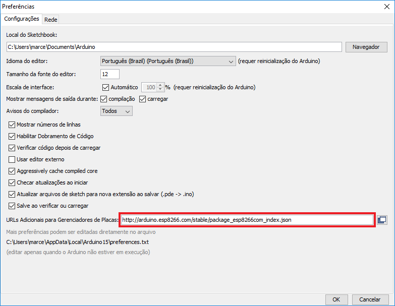
    <p>Figura 8: Adicionando URL</p>
</div>

<div align="justify">

   Depois, vá em **Ferramentas (Tools) > Placa (Board) > Gerenciador de Placas (Board Manager)**, procure por *ESP8266* e selecione **ESP8266 by ESP8266 Community**, clique em **Instalar**. Veja a imagem abaixo:

</div>

<div align="center">
    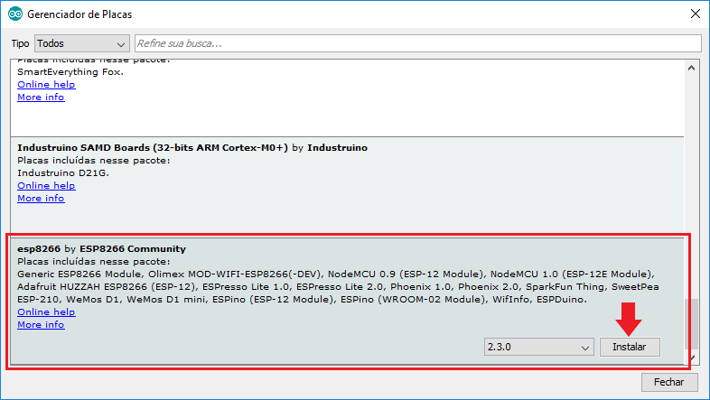
    <p>Figura 9: Instalação do ESP8266</p>
</div>

<div align="justify">

  Depois de instalar o *ESP8266*, vá em **Ferramentas (Tools) > Placa (Board) > ESP8266 Boards > NodeMCU 1.0 (ESP-12E Module)**. Como mostra a imagem abaixo:

</div>

<div align="center">
    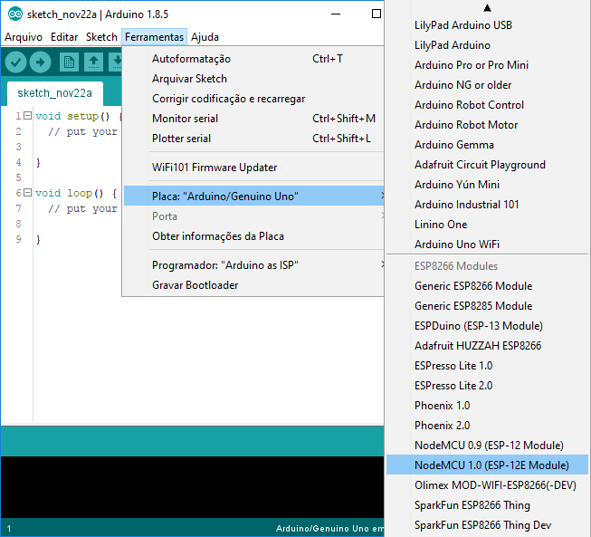
    <p>Figura 10: Seleção do ESP8266</p>
</div>

<div align="justify">

  Agora, o *Arduino IDE* está pronto para ser utilizado com o microcontrolador *ESP8266*.

  #### Bibliotecas para o Sensor de Temperatura DS18B20

  Para instalar a biblioteca do sensor de temperatura, vá em **Sketch (Arquivo) > Incluir Biblioteca (Include Library) > Gerenciar Bibliotecas (Manage Libraries)**. Procure por *OneWire* e *DallasTemperature* e instale as duas bibliotecas. Veja a imagem abaixo:

</div>

<div align="center">
    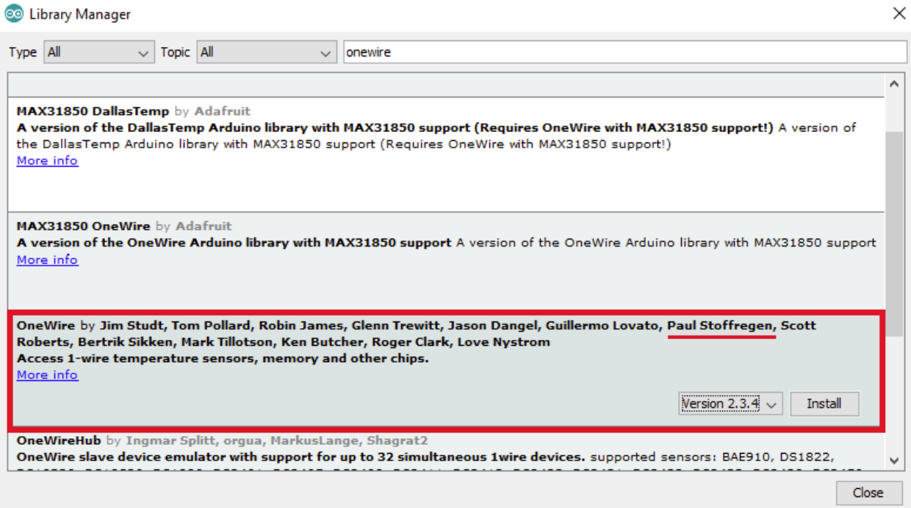
    <p>Figura 11: Instalação da Biblioteca OneWire</p>
</div>

<div align="center">
    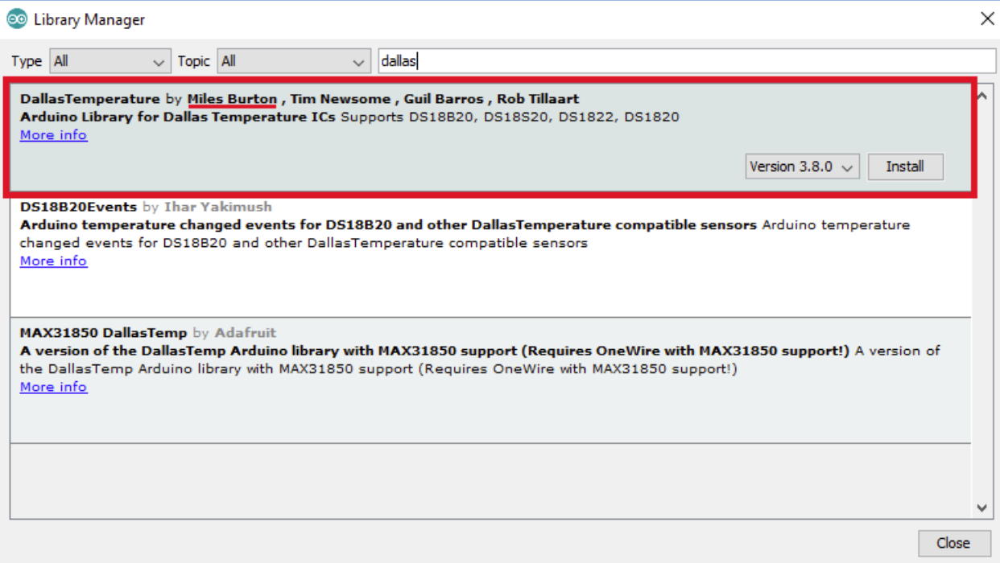
    <p>Figura 12: Instalação da Biblioteca DallasTemperature</p>
</div>

<div align="justify">

  #### Bibliotecas para o Firebase
  É necessário também algumas configurações no código para que o microcontrolador consiga se conectar à rede Wi-Fi e enviar os dados para o banco de dados *Firebase Realtime Database*. Para isso, entre novamente em **Sketch (Arquivo) > Incluir Biblioteca (Include Library) > Bibliotecas (Libraries)** e adicione a biblioteca *Firebase-ESP-Client*. Veja a imagem abaixo:

</div>

<div align="center">
    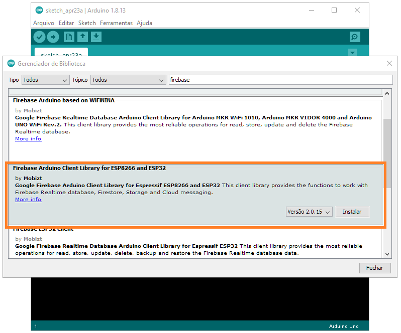
    <p>Figura 13: Instalação da Biblioteca FirebaseESP8266</p>
</div>

<div align="justify">

  E agora está tudo pronto para a execução do programa. 


  6. Atualize o código [codigoEsp.ino](./src/eso8266/codigoEsp.ino) com as informações da sua rede Wi-Fi e sua senha, logo a baixo dos includes, nas linhas `13` e `14`:

  ```cpp  
  
// Insert your network credentials
#define WIFI_SSID ""      // Adicionar o nome da rede
#define WIFI_PASSWORD ""  // Adicionar a senha da rede

  ```
  
  7. Após os passos anteriores, faça o upload do código para o microcontrolador.

  8. Agora o sensor de temperatura estará enviando os dados para o banco de dados *Firebase Realtime Database*.

</div>

### Execução do Programa Web

<div align="justify">
  
  Para compilar e executar o programa, siga os passos abaixo:

  1. Entre no diretório do projeto, que clonaou anteriormente:
  ```console
  cd trabalhoFisicaExp
  ```

2. Instale o *Node.js*:
  - Acesse o site [https://nodejs.org/](https://nodejs.org/) e faça o download da versão LTS.
  - Execute o instalador e siga as instruções.
  - Verifique se o *Node.js* foi instalado corretamente:
    ```console
      node -v
      npm -v
    ```
  - Esses comandos devem retornar as versões instaladas do *Node.js* e do *npm*.

</div>

> [!NOTE] 
> Caso você tenha problemas com a instalação do *Node.js*, consulte a documentação oficial em [https://nodejs.org/](https://nodejs.org/).

<div align="justify">

3. Instale as dependências do projeto:
```console
  npm install
```

4. Execute o projeto:
```console
  npm run dev
```

5. Acesse o endereço [http://localhost:5173](http://localhost:5173) para visualizar o projeto.

Agora você pode visualizar o projeto e realizar os testes necessários. 

</div>

> [!IMPORTANT] 
> É importante lembrar que é necessário que o circuito esteja montado e o sensor de temperatura conectado ao microcontrolador para que o programa funcione corretamente. Pois ele estará mandando os dados para o banco de dados *Firebase Realtime Database* e o site estará requisitando esses dados para mostrar em tempo real.

<p align="right">(<a href="#readme-topo">voltar ao topo</a>)</p>

## 🧪 Ambiente de Compilação e Execução

<div align="justify">

  O trabalho foi desenvolvido e testado em várias configurações de hardware. Abaixo estão as especificações do ambiente de compilação e execução do programa:

</div>

<div align='center'>


| **Hardware** | **Especificações** |
|:------------:|:-------------------:|
| **Laptop**   | Dell Inspiron 13 5330 |
| **Processador** | Intel Core i7-1360P |
| **Memória RAM** | 16 GB DDR5 |
| **Sistema Operacional** | Windows 11 |
| **IDE** | Visual Studio Code |
| **Placa de Vídeo** | Intel Iris Xe Graphics |

</div>

> [!IMPORTANT] 
> Para que os testes tenham validade, considere as especificações
> do ambiente de compilação e execução do programa.

<p align="right">(<a href="#readme-topo">voltar ao topo</a>)</p>

## 📨 Contato

<div align="center">
    <br><br>
     <i>Eduardo Henrique Queiroz Almeida - Graduando - 3º Período de Engenharia de Computação @ CEFET-MG</i>
  <br><br>
  
  [![Gmail][gmail-badge]][gmail-autor1]
  [![Telegram][telegram-badge]][telegram-autor1]

  <br><br>
     <i>Guilherme Alvarenga de Azevedo - Graduando - 3º Período de Engenharia de Computação @ CEFET-MG</i>
  <br><br>
  
  [![Gmail][gmail-badge]][gmail-autor2]
  [![Linkedin][linkedin-badge]][linkedin-autor2]
  [![Telegram][telegram-badge]][telegram-autor2]
  
  <br><br>
     <i>João Francisco Teles da Silva - Graduando - 3º Período de Engenharia de Computação @ CEFET-MG</i>
  <br><br>
  
  [![Gmail][gmail-badge]][gmail-autor3]
  
  <br><br>
     <i>Maria Eduarda Teixeira Souza - Graduando - 3º Período de Engenharia de Computação @ CEFET-MG</i>
  <br><br>
  
  [![Gmail][gmail-badge]][gmail-autor4]
  [![Linkedin][linkedin-badge]][linkedin-autor4]
  [![Telegram][telegram-badge]][telegram-autor4]
  
  <br><br>
     <i>Matheus Emanuel da Silva - Graduando - 3º Período de Engenharia de Computação @ CEFET-MG</i>
  <br><br>
  
  [![Gmail][gmail-badge]][gmail-autor5]
  [![Telegram][telegram-badge]][telegram-autor5]

</div>

<p align="right">(<a href="#readme-topo">voltar ao topo</a>)</p>

## 📚 Referências

<div align="justify">

- SANCHES, D. A.; CAMPOS, L. O.; DIAS, P. H. P.; PEREIRA, T. T. **Automatização Termômetro Calorímetro**. Disponível em: [link](https://padlet.com/rafaelmarcelinocs/trabalhos-f-sica-experimental-h8jfubmun6rlr0p2/wish/v3w8ZwL7jj2oWN52). Acesso em: 04 ago. 2024.

- ALMEIDA, E. H. Q.; AZEVEDO, G. A.; SILVA, J. F. T.; SOUZA, M. E. T.; SILVA, M. E. **trabalhoFisicaExp**. Repositório GitHub. Disponível em: [link](https://github.com/dudatsouza/trabalhoFisicaExp/). Acesso em: 13 set. 2024.

- ALMEIDA, D. E.; RESENDE, F. L.; SILVA, R. M. C. **Física Experimental - MOFT**. 2ª ed. Divinópolis: CEFET-MG, 2024. 43 p.

- YOUNG, H. D.; FREEDMAN, R. A. **Física II: Termodinâmica e Ondas**. Tradução: Daniel Vieira. 14ª ed. São Paulo: Pearson Education do Brasil, 2016. 430 p.

- MAKERHERO. **Sensor de Temperatura DS18B20 à prova d'água**. Disponível em: [link](https://www.makerhero.com/produto/sensor-de-temperatura-ds18b20-a-prova-dagua/#:~:text=O%20Sensor%20de%20Temperatura%20DS18B20,C%20a%20%2B125%C2%B0C). Acesso em: 10 set. 2024.

- EMBARCADOS. **Módulo ESP8266**. Disponível em: [link](https://embarcados.com.br/modulo-esp8266/). Acesso em: 10 set. 2024.

- ENGINEERING TOOLBOX. **Specific Heat Capacity**. Disponível em: [link](https://www.engineeringtoolbox.com/specific-heat-capacity-d_391.html). Acesso em: 10 set. 2024.

- CURTO CIRCUITO. **Como utilizar o DS18B20**. Disponível em: [link](https://circuitocurto.com.br/blog/Categoria%20Arduino/como-utilizar-o-ds18b20). Acesso em: 10 set. 2024.

- ESPRESSIF. **A cost-effective and highly integrated wi-fi mcu for iot applications**. Disponível em: [link](https://www.espressif.com/en/products/socs/esp8266). Acesso em: 10 set. 2024.

- GOOGLE. **Documentação do Firebase**. Disponível em: [link](https://firebase.google.com/docs?hl=pt). Acesso em: 10 set. 2024.

- META PLATFORM. **React-JS**. Disponível em: [link](https://legacy.reactjs.org/). Acesso em: 10 set. 2024.

</div>


[^1]: SANCHES D. A.; CAMPOS L. O.; DIAS P. H. P.; PEREIRA T. T. **Automatização Termômetro Calorímetro**. [Online]. Available:https://padlet.com/rafaelmarcelinocs/trabalhos-f-sica-experimental-h8jfubmun6rlr0p2/wish/v3w8ZwL7jj2oWN52. [Accessed: 04 ago. 2024].

[^2]: YOUNG, H. D.; FREEDMAN, R. A. \textbf{FÍSICA II}: Termodinâmica e Ondas. Tradução: Daniel Vieira. 14. ed. São Paulo: Pearson Education do Brasil, 2016.  430 p.


[vscode-badge]: https://img.shields.io/badge/Visual%20Studio%20Code-0078d7.svg?style=for-the-badge&logo=visual-studio-code&logoColor=white
[vscode-url]: https://code.visualstudio.com/docs/?dv=linux64_deb
[typescript-url]: https://www.typescriptlang.org/
[react-url]: https://reactjs.org/
[vite-url]: https://vitejs.dev/
[miu-url]: https://mui.com/
[firebase-url]: https://firebase.google.com/
[npm-url]: https://www.npmjs.com/
[arduino-ide-url]: https://www.arduino.cc/en/software
[make-badge]: https://img.shields.io/badge/_-MAKEFILE-427819.svg?style=for-the-badge
[make-url]: https://www.gnu.org/software/make/manual/make.html
[main-ref]: src/main.cpp
[branchAMM-url]: https://github.com/alvarengazv/trabalhosAEDS1/tree/AlgoritmosMinMax
[makefile]: ./makefile
[bash-url]: https://www.hostgator.com.br/blog/o-que-e-bash/
[lenovo-badge]: https://img.shields.io/badge/lenovo%20laptop-E2231A?style=for-the-badge&logo=lenovo&logoColor=white
[ubuntu-badge]: https://img.shields.io/badge/Ubuntu-E95420?style=for-the-badge&logo=ubuntu&logoColor=white
[Ubuntu-url]: https://ubuntu.com/
[ryzen5500-badge]: https://img.shields.io/badge/AMD%20Ryzen_5_5500U-ED1C24?style=for-the-badge&logo=amd&logoColor=white
[ryzen3500-badge]: https://img.shields.io/badge/AMD%20Ryzen_5_3500X-ED1C24?style=for-the-badge&logo=amd&logoColor=white
[windows-badge]: https://img.shields.io/badge/Windows-0078D6?style=for-the-badge&logo=windows&logoColor=white
[gcc-badge]: https://img.shields.io/badge/GCC-5C6EB8?style=for-the-badge&logo=gnu&logoColor=white
[typescript-badge]: https://img.shields.io/badge/TypeScript-007ACC?style=for-the-badge&logo=typescript&logoColor=white
[react-badge]: https://img.shields.io/badge/React-20232A?style=for-the-badge&logo=react&logoColor=61DAFB
[vite-badge]: https://img.shields.io/badge/Vite-B73BFE?style=for-the-badge&logo=vite&logoColor=FFD62E
[firebase-badge]: https://img.shields.io/badge/Firebase-FFCA28?style=for-the-badge&logo=firebase&logoColor=white
[miu-badge]: https://img.shields.io/badge/Material%20UI-007FFF?style=for-the-badge&logo=mui&logoColor=white
[npm-badge]: https://img.shields.io/badge/npm-CB3837?style=for-the-badge&logo=npm&logoColor=white
[arduino-ide-badge]: https://img.shields.io/badge/Arduino_IDE-00979D?style=for-the-badge&logo=arduino&logoColor=white
[trabalho-url]:https://drive.google.com/file/d/11tvEmPrVSYZFsJzXbcc15Ags8CLRJByU/view?usp=sharing
[grid-search]: https://github.com/alvarengazv/lac-algorithm/tree/grid-search

[telegram-autor1]: https://t.me/5534998366402
[gmail-autor1]: mailto:eduardo.almeida@aluno.cefetmg.br

[linkedin-autor2]: https://www.linkedin.com/in/guilherme-alvarenga-de-azevedo-959474201/
[telegram-autor2]: https://t.me/alvarengazv
[gmail-autor2]: mailto:gui.alvarengas234@gmail.com

[gmail-autor3]: mailto:joao.silva.05@aluno.cefetmg.br

[linkedin-autor4]: https://www.linkedin.com/in/maria-eduarda-teixeira-souza-2a2b3a254   
[telegram-autor4]: https://t.me/dudat_18
[gmail-autor4]: mailto:dudateixeirasouza@gmail.com

[telegram-autor5]: https://t.me/5599991240774
[gmail-autor5]: mailto:memanuel643@gmail.com

[linkedin-badge]: https://img.shields.io/badge/-LinkedIn-0077B5?style=for-the-badge&logo=Linkedin&logoColor=white
[telegram-badge]: https://img.shields.io/badge/Telegram-2CA5E0?style=for-the-badge&logo=telegram&logoColor=white
[gmail-badge]: https://img.shields.io/badge/-Gmail-D14836?style=for-the-badge&logo=Gmail&logoColor=white
